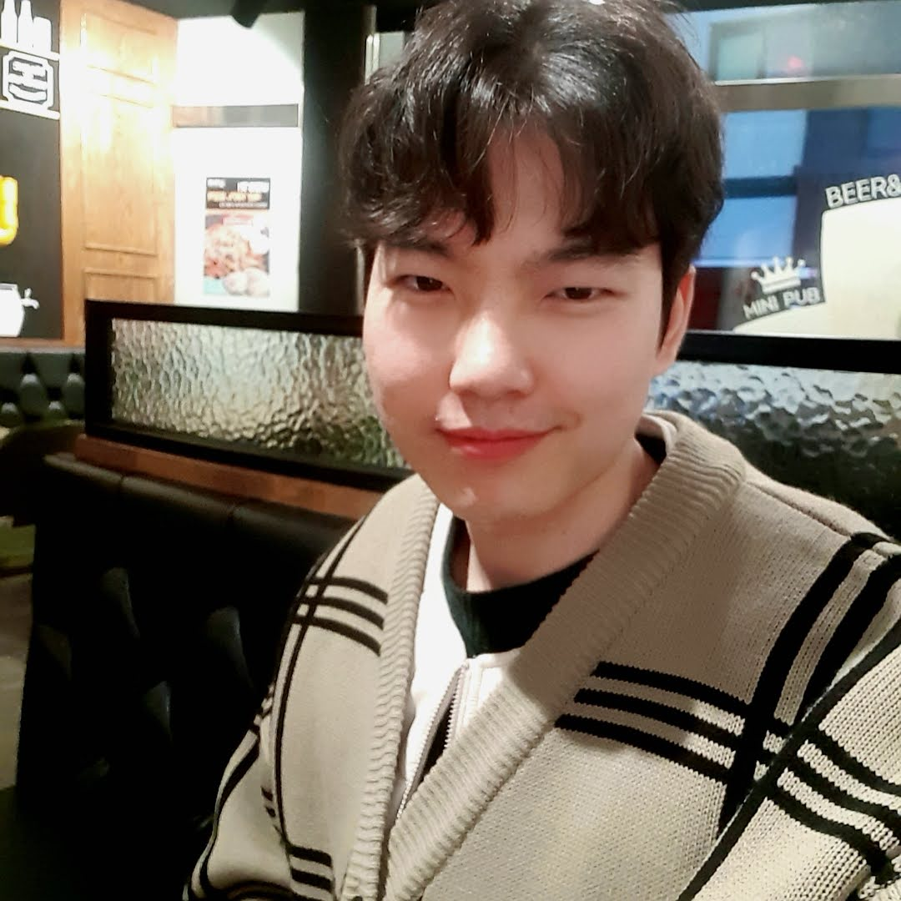
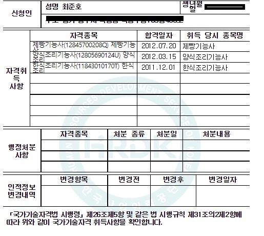

# 소개 :construction_worker:

>## 최준호
>요리하는 프로그래머 최준호 입니다
>
> : wnsghqwe@gmail.com

>## My SNS 
> 

>## My Github Stats
>

>## My Top Languages
>

# 학력 및 경력 :man:
* [한국조리과학고등학교](http://www.kcas.hs.kr/) :school_satchel:
    - 기간 : 2010 - 2012
  
* [오산대학교](https://www.osan.ac.kr/) :mortar_board:
    - 호텔조리과(3년제)
    - 기간 : 2013 - 2018
  
* [아워홈](https://www.ourhome.co.kr/) :rice:
    - 조리실장 및 점장 업무
    - 기간 : 2018.4.19 -2020.12.31
  

# 자격증 내역

- 정보통신기사 취득 목표로 학습중
   

# 교육 받고 있는 개발 툴   
 

- ## Flutter
    

- ## VScode
    

>|Tool|언어|상태|
>|------|---|---|
>|Flutter|dart|교육중|
>|VScode|MarkDown|교육중|

